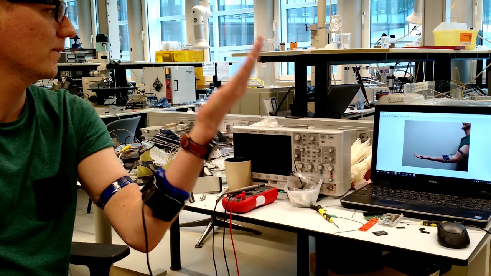

# Raspberry-bioamplifier
This repository contains the source of a bioamplifier based on a Raspberry Pi Zero w that streams data to matlab. The project was made at the NIFTy group at the University of Twente as a demonstrator for the IEEE student measurement challange at the IEEE conference in Glasgow in 2017. 

To be able to measure the EMG and FMG a bioamplifier shield for the raspberry pi zero w is develloped. The schematic and the layout of the pcb can be found in the bioamplifier folder. This PCB contains an 24 bit ADC, a quad opamp for measurements and one aditional single opamp that can be used as a driven right leg. As this was a prototype, each opamp has many resistors placed around it that do not all have to be soldered. By soldering certain resistors the opamp can be configured as a FMG sensor or as an EMG sensor. The specific configuration used for the demo in Glasgow can be found in the folder "demo configuration"

The data form the adc is read out using an Raspberry Pi Zero W. The program written in c++ used to read out the ADC and send the data to matlab via TCP/IP can be found in the "raspberry code" folder. The matlab scripts used to stream and process the data on the other side can be found in the folder "matlab scripts".

This project has received funding from the European Union’s Horizon 2020 research and innovation programme under grant agreement No. 688857 (SoftPro)
